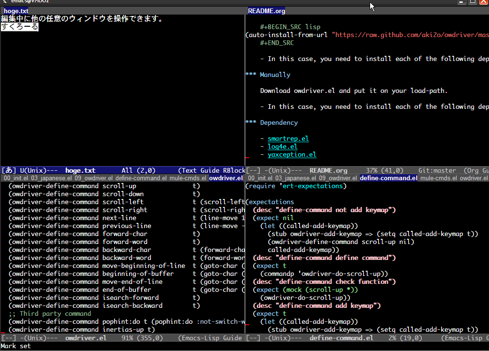

[](https://travis-ci.org/aki2o/owdriver)

# What's this?

This is a extension of Emacs that provides the function for doing various action to
other windows without `other-window` in multi window situation.  
In default, that's move, scroll and isearch.  
Moreover, you can add the action what you want.  

# Demo



# Install

### If use package.el

2014/04/27 It's available by using melpa.

### If use el-get.el

2014/04/27 It's available. But, master branch only.

### If use auto-install.el

```lisp
(auto-install-from-url "https://raw.github.com/aki2o/owdriver/master/owdriver.el")
```
-   In this case, you need to install each of the following dependency.

### Manually

Download owdriver.el and put it on your load-path.  
-   In this case, you need to install each of the following dependency.

### Dependency

-   
-   
-   

# Configuration

### Sample

```lisp
(require 'owdriver)
(global-unset-key (kbd "M-o"))
(setq owdriver-prefix-key "M-o")
(owdriver-config-default)
(owdriver-mode 1)

(global-set-key (kbd "M-h") 'owdriver-do-scroll-right)
(global-set-key (kbd "M-j") 'owdriver-do-scroll-up)
(global-set-key (kbd "M-k") 'owdriver-do-scroll-down)
(global-set-key (kbd "M-l") 'owdriver-do-scroll-left)
```
-   For detail, see below.

### Set prefix key

Set prefix key for  using `owdirver-prefix-key`.  
You can control target window by the same way as active window after pushing the key only once.  
For detail, see .  

### Control without prefix key

If you have the action which you want to do directly to target window without `owdriver-prefix-key`,  
Bind key to the command named `owdriver-do-...`.  
About the command, see below.  

### Define command after prefix key

You can define the control of target window by `owdriver-define-command`.  
Then, the command named `owdriver-do-...` is defined.

### Add key binding after prefix key

The same key is bound as global map by `owdriver-define-command`.  
If you add/change the key binding, use `owdriver-add-keymap` before activate `owdriver-mode`.  

### Default configuration

Here is the default configuration by `owdriver-config-default`.  

```lisp
;; Own command
(owdriver-add-keymap "C-o"        'owdriver-next-window)
(owdriver-add-keymap "C-S-o"      'owdriver-previous-window)
(owdriver-add-keymap "<C-return>" 'owdriver-focus-window)
(owdriver-add-keymap "<return>"   'owdriver-quit)
(owdriver-add-keymap "C-q"        'owdriver-quit)
;; Basic command
(owdriver-define-command newline                 t (owdriver-quit))
(owdriver-define-command scroll-up               t)
(owdriver-define-command scroll-up-command       t)
(owdriver-define-command scroll-down             t)
(owdriver-define-command scroll-down-command     t)
(owdriver-define-command scroll-left             t (scroll-left 10 t))
(owdriver-define-command scroll-right            t (scroll-right 10 t))
(owdriver-define-command next-line               t)
(owdriver-define-command previous-line           t)
(owdriver-define-command forward-char            t)
(owdriver-define-command forward-word            t)
(owdriver-define-command backward-char           t)
(owdriver-define-command backward-word           t)
(owdriver-define-command move-beginning-of-line  t)
(owdriver-define-command move-end-of-line        t)
(owdriver-define-command beginning-of-buffer     t)
(owdriver-define-command end-of-buffer           t)
(owdriver-define-command isearch-forward         t (isearch-forward))
(owdriver-define-command isearch-backward        t (isearch-backward))
(owdriver-define-command set-mark-command        t)
(owdriver-define-command kill-ring-save          t (call-interactively 'kill-ring-save) (deactivate-mark))
;; Third party command
(owdriver-define-command pophint:do t (pophint:do :not-switch-window t))
(owdriver-define-command inertias-up t)
(owdriver-define-command inertias-down t)
```

If you mind it, you should do configuration without `owdriver-config-default`.  

# Usage

### Start to control other window

Push `owdriver-prefix-key`.  
Then, you can control target window by the same way as active window.  
Or, you can control directly by pushing the key bound to `owdriver-do-...`.  

### Change target window

You can change target window by the following way.  
-   push the key bound to `owdriver-next-window` / `owdriver-previous-window` after `owdriver-prefix-key`
-   give prefix argument to the command named `owdriver-do-...` without `owdriver-prefix-key`

If  is installed, show hint to select target window.  

### Finish and turn back to active window

You turn back to active window by the following way.  
-   push the key not bound to the keymap after `owdriver-prefix-key`
-   push the key bound to `owdriver-quit` / `keyboard-quit`

### Finish and focus on target window

If you want to change active window to target window, push the key bound to `owdriver-focus-window`.  

# Tested On

-   Emacs &#x2026; GNU Emacs 24.3.1 (i686-pc-linux-gnu, GTK+ Version 3.4.2) of 2014-02-22 on chindi10, modified by Debian
-   smartrep.el &#x2026; 0.0.3
-   log4e.el &#x2026; 0.2.0
-   yaxception.el &#x2026; 0.2.0

**Enjoy!!!**
